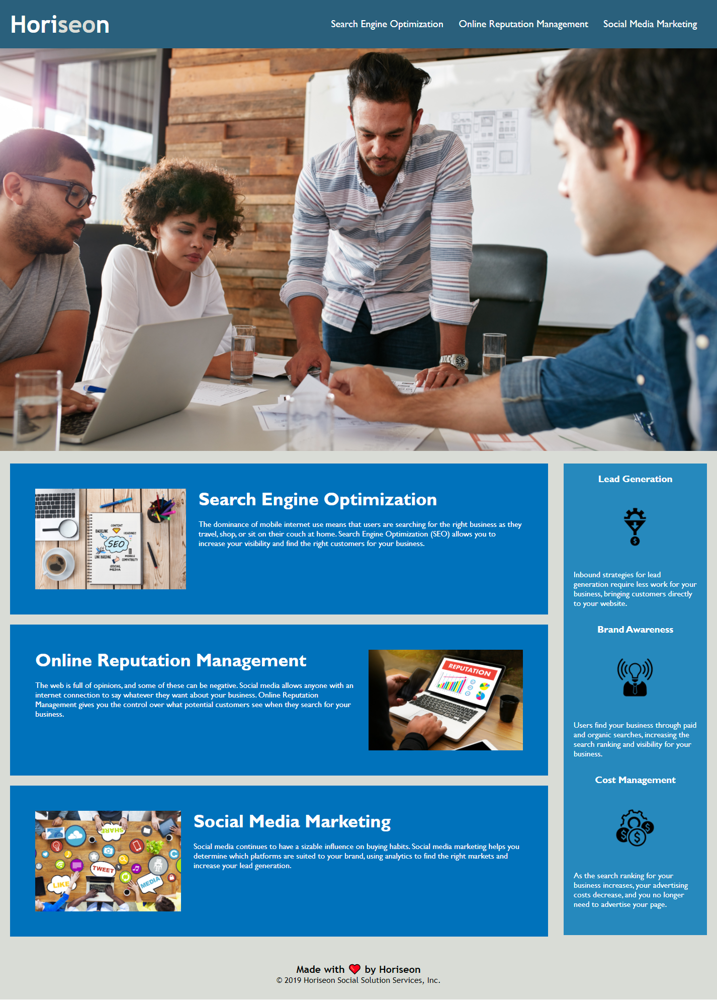

# Week 02 Refactoring Homework  
## HTML refactoring  
Working systematically through the code I initially undertook 3 changes to make the code work correctly and to fill in the missing gaps.  
1. Creating a concise title for the tab of the page, I chose the name of the company
2. There was a missing id for the Search Engine Optimization class, which meant that when the link in the nav bar was clicked on, it didn't work.  By adding the id it created functionality for the link.
3. There were no alt attributes given to any of the images linked to in the html.  Therefore the page was inaccessible for anyone using a screen reader.  By adding alt attributes, describing the content of the images, I was able to make the page more usable. 

I then looked more closely at the page itself, and there were elements that needed addressing to further make the page more accessible.  To do this I had to go and do some research about accessibility in webpages.  I came across "Accessible Rich Internet Applications" (ARIA) which enabled me to further increase the accessibility of the page as follows:
1. By using an aria-label and span, I was able to annotate the heart emoji that was found in the footer of the html.
2. By using an aria-label I was able to ascribe meaning to the background image that takes up a large portion of the page, and would have been otherwise inaccessible. 

## CSS refactoring  
Moving onto the CSS code and there were a few things that could be done to make it more efficient.
1. The calibri font was missing the '' notation in every instance. I therefore amended this. 
2. There was alot of repetition in much of the styling of the classes, so I was able to group these classes together, thereby making the code more succinct, easier to read, and more efficient. 

As I made each of these changes, I commented on the changes made within the code itself, and pushed the changes to my repo on Github.  

## What else I would have liked to have done  

The remit for refactoring the page was limited.  I would also like to have looked into deploying media queries to make the website responsive for a wide variety of devices.  

## The finished work  
The deployed application is found on [Github Pages](https://clairemdavies.github.io/week-02-refactoring-homework/) 

The screenshot of the refactored page is seen below: 

